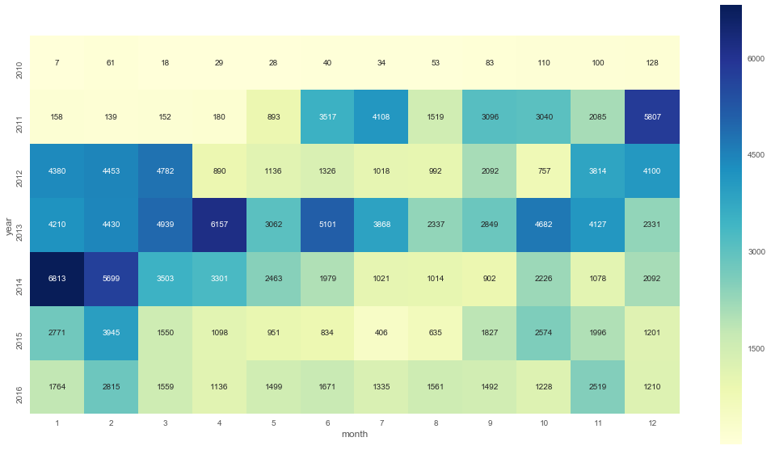
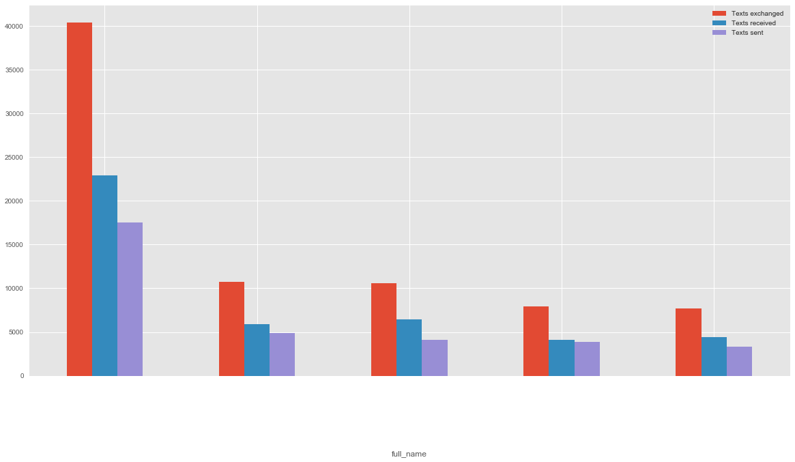
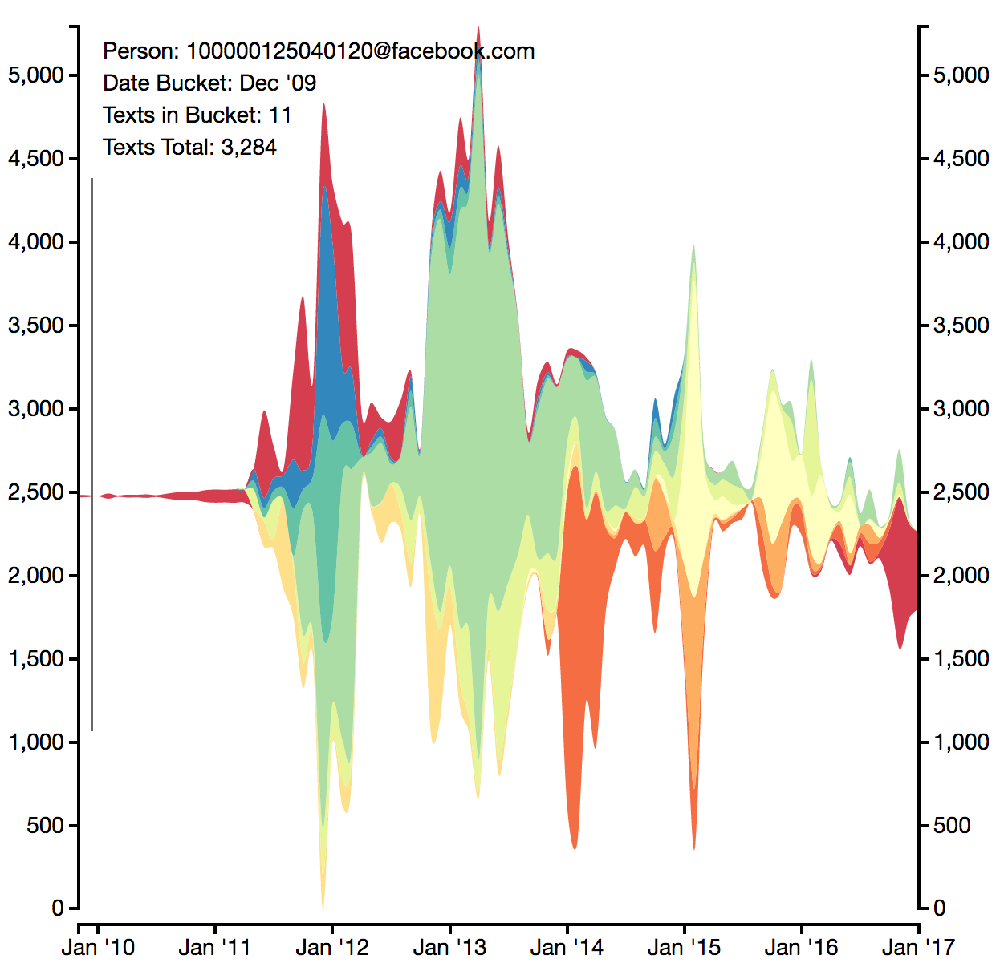
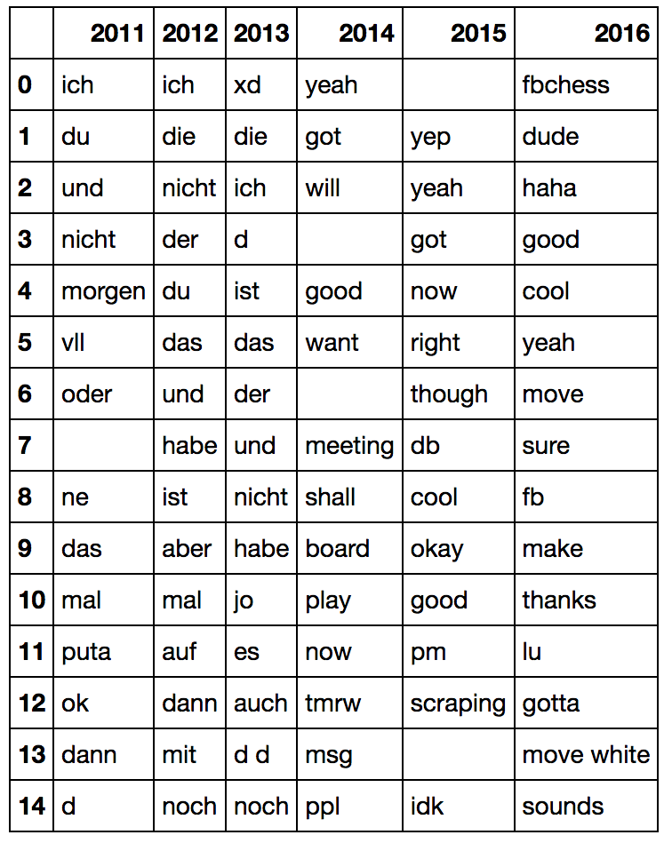
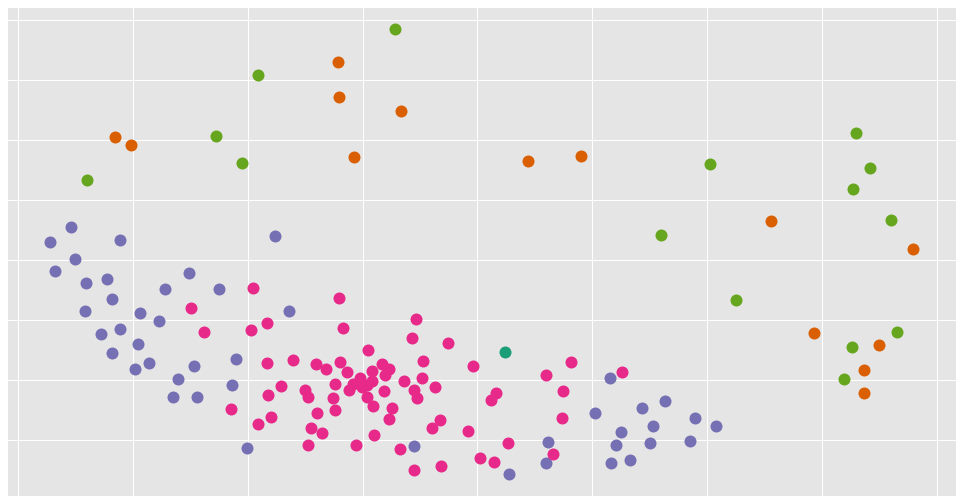

About a year ago I attended a [Meetup on D3.js](https://www.meetup.com/it-IT/NYC-D3-JS/events/236673854/). The first talk by [Michael Dezube](https://github.com/mdezube) was on using machine learning to analyze text messages and visualize the results. Today I want to walk through all the awesomeness we have in this project.

# Demo
The first chart we see is this

Here it simply shows us our messaging habits over the years. Kinda amazing how it varies. But let's dive deeper. The important question really is: Who did we message? We can display the top N people:

But who did we message and when?

This graph is really amazing! It's almost a history of my life. Looking back at it, I can see when I made friendships and how they were developing. This is probably my favorite visualization!

After that we have a word cloud and a tree for visualizing conversations, but it's a little too personal for me to post online.

Later in the Jupyter notebook we find a chart that shows us our top words over the years, accounting for the relative frequency in other years:

Here we not only see me moving to the US, but also how I was interacting. The blacked out sections are names of people. Fascinating who I was talking about 😉.

Lately this project has not seen any attention, but there is still so much more to explore.

# My contribution
After the presentation I was super excited about the idea and wanted to try it out. Unfortunately it only supported iPhones. So I added an Facebook Chat connector. It still has minor issues, such as an ID not being properly resolved, but it works (in fact all those charts above are based on FB).

I have also been looking into clustering. Having the word vectors would allow us to cluster our text/chat partners and see who we interact with similarly. It is not done yet, but this is how a first draft looks (names purposefully omitted).

# Check it out
I'd recommend anybody to check out the repository. Michael has been awesome in reviewing my code and gave me so many helpful tips. You can find the repository [here](https://github.com/mdezube/sms-analysis).
